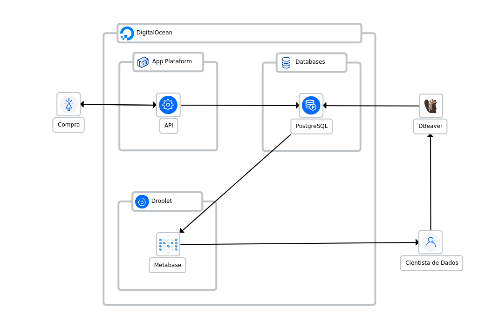

### Sobre o problema

A empresa Magazine Maria enfrenta desafios significativos relacionados à 
detecção e prevenção de fraudes em transações de compras em seu site. Como uma 
plataforma de comércio eletrônico em crescimento, a Magazine Maria experimentou 
um aumento nas tentativas de fraudes por parte de usuários mal-intencionados que 
procuram realizar transações fraudulentas, resultando em prejuízos financeiros 
e danos à reputação da empresa.

Embora a Magazine Maria já possua um modelo de detecção de fraudes em operação, 
ele enfrenta limitações em termos de precisão e capacidade de adaptação a 
padrões de fraude em constante evolução. Portanto, aprimorar e desenvolver um 
modelo de detecção de fraudes mais eficaz tornou-se uma prioridade para a 
empresa.

Este projeto visa melhorar o modelo de detecção de fraudes da Magazine Maria, 
utilizando técnicas avançadas de aprendizado de máquina e análise de dados. O 
objetivo é desenvolver um sistema mais preciso e robusto que possa identificar 
padrões de fraude de maneira mais eficiente, reduzindo assim os prejuízos 
financeiros e fortalecendo a segurança das transações para os clientes e para 
a própria empresa.

### Objetivo

O objetivo deste projeto é aprimorar o sistema de detecção de fraudes da 
Magazine Maria por meio da implementação de um modelo de aprendizado de máquina 
mais sofisticado e eficaz. Buscamos desenvolver um sistema capaz de identificar 
e prevenir transações fraudulentas com maior precisão e rapidez, minimizando 
assim os prejuízos financeiros e protegendo a integridade da plataforma de 
comércio eletrônico.

Além disso, é de interesse da empresa que o modelo final seja monitorado, para 
agir com rapidez em casos de drift. 

### Sobre os dados

- score_1 a score_10: São notas de bureau de crédito que a empresa adquiriu para 
identificar se o comprador é confiável ou outros dados anonimizados que não 
temos informação sobre.
- País: pais de compra.
- Produto: produto que está sendo comprado no e-commerce.
- Categoria_produto: categoria a qual esse produto se encaixa.
- Entrega_doc_1 a entrega_doc_3: Documentos requisitados no momento de fazer a 
conta. 0 = N = nao entregou. Y = 1 = entregou. Se vazio, considere que nao 
entregou.
- Score_fraude_modelo: score dado pelo modelo atual. É a probabilidade daquela 
compra ser uma fraude ou nao. Quanto mais próximo de 100, maior a certeza do 
modelo que é fraude.
- Fraude: informacao se aquela compra era fraudulenta ou nao. Foi inserida após 
alguns dias, para termos o feedback real se de fato era fraudulenta ou nao. 0 
se nao era fraudulenta e 1 se era fraudulenta.


### Métricas de avaliação

Como a empresa ganha 10% do valor de um pagamento aprovado corretamente e a cada 
fraude aprovada perdemos 100% do valor do pagamento, optaremos por priorizar em 
reduzir a taxa de falsos negativos, que trazem um maior prejuízo. Devido a isso, 
a métrica de avaliação principal para o modelo será o Recall. Em complemento,
também acompanharemos o f1 score weighted, que incluirá a parte dos verdadeiros
negativos, que são os que trazem lucro para a empresa. Optaremos pelo weighted 
ao invés do f1 score normal devido ao desbalanceamento das classes.   

Além da precisão na detecção de fraudes, também é importante considerar a 
eficiência do modelo em termos de tempo de processamento. Por isso, levaremos 
em conta também a latência das previsões.

Ao acompanhar essas métricas, poderemos avaliar não apenas a eficácia do modelo 
na detecção de fraudes, mas também sua capacidade de responder de forma 
eficiente e oportuna às ameaças, contribuindo assim para a segurança e 
estabilidade contínuas das operações da Magazine Maria.

### Melhorias
- [X] Treinar um modelo superior ao atual.
- [X] Testar novos algoritmos.
- [X] Realizar a criação de uma API.
- [X] Implantar um sistema de monitoramento.
- [ ] Criar um relatório apresentando o problema e a solução criada.

### Instruções para execução do projeto

Esse projeto foi desenvolvido usando o Python 3.10.12. Para executar o projeto,
siga os passos abaixo:

1. Clone o repositório:
```sh
git clone https://github.com/dnsrsdata/preditor_fraude
```
2. Instale o poetry:
```sh
pip install poetry
```
3. Inicie o poetry:
```sh
poetry init
```
4. Instale as dependências do projeto:
```sh
poetry install
```
5. Execute os notebooks

### Descrição dos arquivos


### Resultados
Dois modelos foram treinados com o objetivo de substituir o modelo antigo. Segue
a tabela com os resultados:<br>
|               | Melhor Threshold | Melhor Recall | Melhor F1 | Latência Média (ms) | Ganho Bruto |  Perdas  | Ganho Líquido | Taxa de Fraude (%) |
|:-------------:|:----------------:|:-------------:|:---------:|:-------------------:|:-----------:|:--------:|:-------------:|:--------------:|
| Modelo Antigo |       0.76       |      0.64     |    0.84   |          -          |   65912.19  | 19549.98 |    46362.21   |       1.8      |
|  Logística_v2 |       0.63       |      0.41     |    0.90   |          20         |   65839.97  | 24752.43 |    41087.54   |      1.34      |
|    LightGBM   |       0.66       |      0.48     |    0.90   |          39         |   73055.77  | 22947.13 |    50108.64   |      1.38      |

Dados os possíveis ganhos, uma API foi criada com base no modelo que trouxe mais lucro. Assim, seria possível integrar a API ao sistema de transações do e-commerce. Toda a solução foi  implantada na DigitalOcean. Segue o diagrama de implantação da API e a função de cada componente:



- **Compra**: representa o ato de confirmar a compra por parte do cliente.
- **API**: representa a API contendo o modelo junto da etapa de pré-processamento.
- **PostgreSQL**: banco de dados SQL, onde está armazenado os dados usados para treinar e avaliar o modelo. Também é usado para armazenar as novas solicitações e as labels de previsão.
- **Metabase**: máquina virtual rodando o Metabase. Aqui, os dados usados no desenvolvimento são comparados com os novos dados a fim de acompanhar o drift nos mesmos. É a camada de monitoramento.
- **DBeaver**: Gerenciador local usado para se conectar ao PostgreSQL, enviar os dados de desenvolvimento do modelo e criar as tabelas para armazenar as previsões e os dados das transações.
- **Cientista de Dados** responsável por monitorar e subir os dados de desenvolvimento para o banco de dados.

Com base nisso, temos nossa solução, que pode ser integrada ao sistema de compras da Magazine Maria. Para testes, é possível enviar solicitações através de serviços como o Postman para a seguinte URL: https://clownfish-app-svug3.ondigitalocean.app/prever

Segue um exemplo de solicitação:
```
{
    "score_1": 5,
    "score_2": 12,
    "score_3": 15.0,
    "score_4": 1.8,
    "score_5": 4.2,
    "score_6": 3.0,
    "pais": "Brasil",
    "score_7": 4,
    "produto": "PRODUTO A",
    "categoria_produto": "CATEGORIA A",
    "score_8": 4.0,
    "score_9": 5.0,
    "score_10": 2.5,
    "entrega_doc_1": 1,
    "entrega_doc_2": "Y",
    "entrega_doc_3": "Y",
    "data_compra": "2020-05-22",
    "valor_compra": 10.0
}

```
Todos os campos receberam os tipos originais, de acordo com os dados raw.
